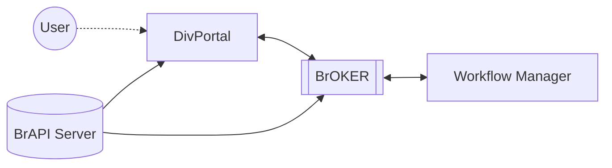

# DivPortal

## About DivPortal

DivPortal is a web application for the interactive visualization and exploration of plant phenotyping trials. 

As data backend it uses a BrAPI server, visualizing its trial results and general information about the available germplasm. Additionaly it allows to start analysis workflows on this data by integrating a brokering service between workflow managers and the connected BrAPI server. 

## Installation

Information on how to install DivPortal is given in the documentation. In general DivPortal offers a ```docker-compose.yml``` that allows deployment of the instance.

```
docker compose up --build -d
```

## Try out DivPortal

A demo instance is available at https://divportal.ipk-gatersleben.de

## Architecture

